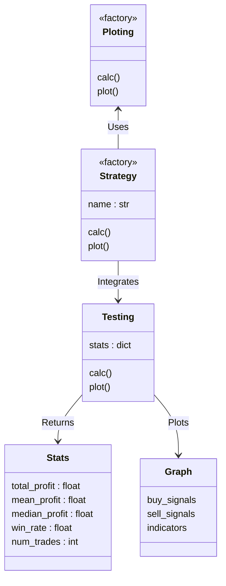

```mermaid
classDiagram
    class Strategy{
        <<factory>>
        name : str
        calc()
        plot()
    }
    class Testing{
        stats : dict
        calc()
        plot()
    }

    class Stats{
        total_profit : float
        mean_profit : float
        median_profit : float
        win_rate : float
        num_trades : int
    }

    class Ploting{
        <<factory>>
        calc()
        plot()
    }

    class Graph{
        buy_signals
        sell_signals
        indicators
    }

    Strategy --> Testing : Integrates
    Ploting <-- Strategy : Uses
    Testing --> Stats : Returns
    Testing --> Graph : Plots
```